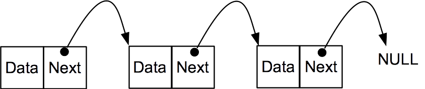
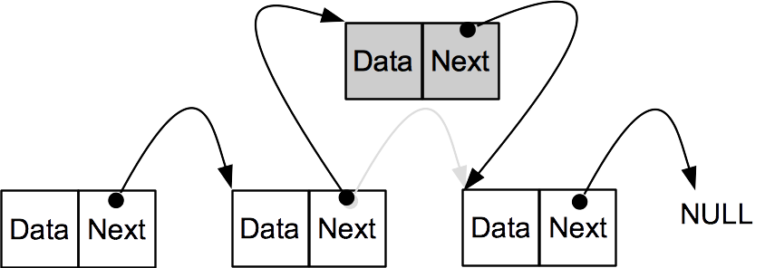
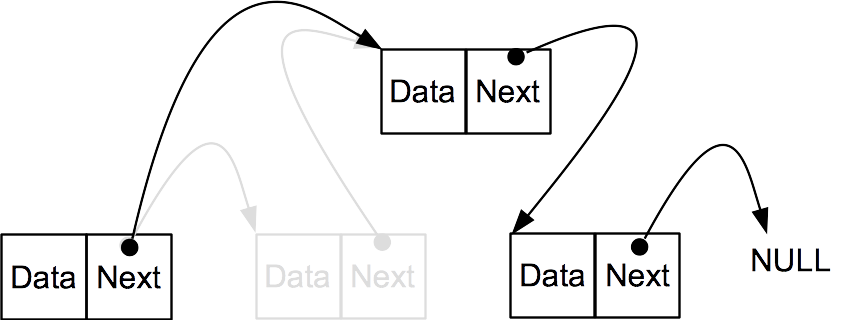
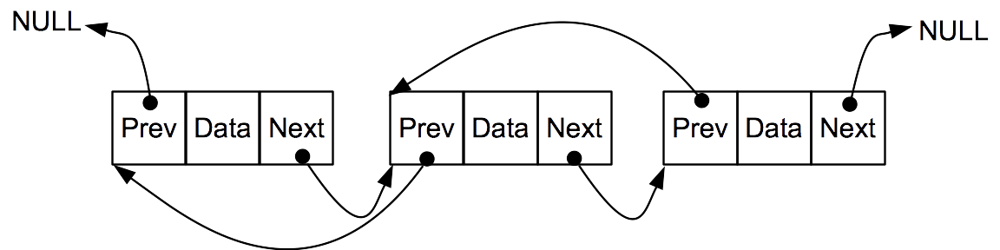
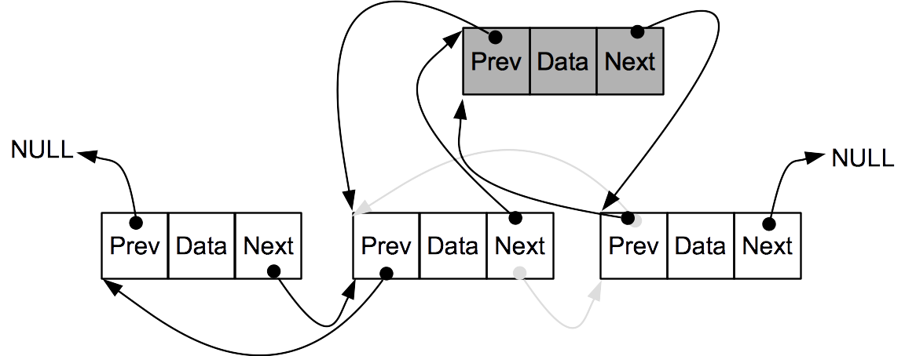
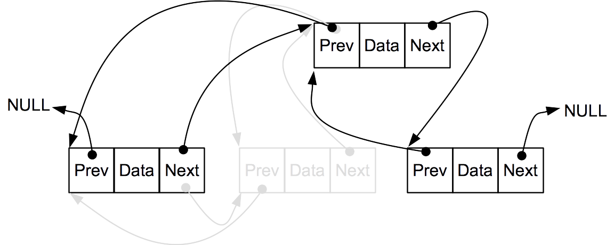

Instructions - task 1803d-ht18
======
_Johan Holmgren, 2018-09-19_

Overview and purpose of task
----

The purpose of this assignment is that should learn how to implement a linked list data structure, which is a commonly used data structure in embedded systems. 

A linked list can be seen as a series of elements (or objects) that are linked to each other, thus forming a chain of elements.  
Each element contains a data field (which could be a complex structure) and one or more pointers to other elements. 
In this assignment you will implement two types of linked lists. 


In addition, you will formulate and implement your own test cases using the unity test tool (see [http://www.throwtheswitch.org/unity](http://www.throwtheswitch.org/unity)), using the knowledge you gained in the previous course assignments and in the lecture about test-driven development. 

You will conduct this assignment in pairs of two students; however, in exceptional cases it is also possible to work individually. 


Preparation
------

Before the scheduled laboratory assignment you should complete the following steps:

* Study the powerpoint material about linked lists.
* Read this assignment specification before the scheduled laboratory session. It is recommended to start working with this assignment before the scheduled laboratory session, since it will most likely take longer than 8 hours to complete this assignment.   
* Refresh the 'Cygwin' and 'Hello world using Cygwin' parts of the 'DA267A - Laboratory environment' document if needed.  
* Study the lecture material about test-driven development. 


You are provided a sample make file for the assignment, which contains three main targets: `build_unity_test_single`, `build_unity_test_double`, and `clean`. 
The `build_unity_test_single` and  `build_unity_test_double` targets compile your unity test programs, and the `clean` target removes all the binary files that are generated during compilation and linking. Please note that it is common practice to not add compiled files to git repositories.


Introduction to linked lists
------


A linked list is a data structure that contains a chain of elements that are linked to each other in sequence. 


There are different types of linked lists; however, a common characteristic of linked lists is that you access elements by traversing the chain of linked elements until you find the element you are looking for. 
For example, if you want to access an element somewhere in the chain of elements, you first need to visit the first element in the chain in order to get access to the second element. 
Then you visit the second element in order to get access to the third element. 
Then you continue in this way until you find the element you want to access. 
When you want to insert an element somewhere in the linked list, you need to search through the linked list in the same way. 


In this assignment you will work with two types of linked lists: _single linked lists_ and _double linked lists_, each of which are described below. 

### Single linked list
A single linked list is a chain of elements, where each of the elements, except for the last element, in the list has a pointer `next` to the next element in the list. 
The last element points to nothing (or `NULL`) in order to indicate that it is the end of the list.

The following picture illustrates a single linked list containing three elements. 



The following image shows what will happen when a new element (in grey) is added between the second element and the third element in a single linked list. Please note what happens with the `next` pointers of the second and the new element. 



The following image shows what will happen when the second element is removed from the list. Please note what happens with the `next` pointer of the first element.  




### Double linked list
A double linked is a chain of elements, where each of the elements, except for the first and last element, in the list has a pointer (`previous`) to the previous element  in the list and a pointer (`next`) to the next element in the list. 

For the last element in the list, `next`  points to nothing (`NULL`) and for the first element in the list, (`previous`) points to nothing (`NULL`).


The following image illustrates a double linked list containing three elements. 





The following image illustrates what happens when you insert an element (between the second and third elements) in a double linked list containing three elements. 
Please study what happens with the pointers of the new element, and the second and third elements. 





The following image illustrates what happens when you remove an element (the second element) in a double linked list containing four elements. 
Please study what happens with the pointers of the new element, and the second and third elements. 




 


Description of task
------

Your task in this laboratory assignment is to implement a number of functions that allow you to work with a single linked list and with a double linked list. 
The elements should contain an integer (data) value that you will use to sort the elements. 
That means that when you add a new element in the linked list, you should make sure that you maintain a sorted linked list. 
The first element is the smallest element in the list, the second element is the second smallest element in the list, and so on. The last element is the largest element in the list.  
 

You are given two header files `single_linked_list.h` and `double_linked_list.h`which specifies all of the functions you should implement. 
In addition, you will implement a number of test cases using the unity test framework.


### Create and clone your assignment git repository
The first thing you need to do is to create your group's git repository for this assignment and clone your repository to your local computer. 

In your git repository you find two folders: `Instructions` and `task`. In the instructions folder you find this assignment instruction, and in the task folder you find all the code needed to work with this assignment. 

In particular, the task folder contains a make file and four subfolders: `src`, `bin`, `test`, and `unity`. 


* The `src`folder contains the `single_linked_list.h` and `double_linked_list.h` header files and empty c source code files `single_linked_list.c` and `double_linked_list.c`, which you will modify. 
* All the compiled code will be saved in the `bin` folder if you use the provided make file. 
* You will create your test cases in the `test` folder.
* You find the unity framework in the `unity folder`.


### Implement a single and a double linked list

As mentioned above, you are provided two c header files `single_linked_list.h` and `double_linked_list.h`, which contains a single linked list data structure and a double linked list data structure, respectively. 


The single linked list data structure is defined in the following way:

```
struct linkedList{
  struct linkedListElement *first;
};
```
The elements in a single linked list are defined in the following way:

```
struct linkedListElement{
  int data;
  struct linkedListElement *next;
};
```


The double linked list data structure is defined in the following way:

```
struct linkedList{
  struct linkedListElement *first;
  struct linkedListElement *last;
};
```
The elements in a double linked list are defined in the following way:

```
struct linkedListElement{
  int data;
  struct linkedListElement *next;
  struct linkedListElement *previous;
};
```


The `single_linked_list.h` and `double_linked_list.h` header files contains an identical set of functions that you will implement in this assignment: 

* `int addElement()`
* `void initLinkedList()`
* `int removeFirstElement()`
* `int removeLastElement()`

However, please note that these functions will be implemented differently for a single linked list and a double linked list. Specifications of each of these functions are provided in the provided header files.


In this assignment you are expected to use the 
standard c memory management functions `malloc()`, `calloc()`, and `free()`, defined in `stdlib.h`, when allocating and releasing memory. 
In an embedded system, which is typically very memory constrained and you need to be careful about which part of the memory you use for different purposes, this is typically not how you would manage memory. 
However, in this assignment we want you to practice memory management using the standard c approach (using `malloc()`, `calloc()`, and `free()`).  

Please note that you are recommended to test, using pen and paper, what will happen with your linked lists when you run the operations you will implement in your functions. 
This might help you understand how to write your code. 


### Implement test cases
As part of this assignment you should implement a set of test cases (both black box and white box) using the unity test framework, which you have used  in the previous laboratory assignments in this course. The difference now is that you should both identify and implement a set of relevant test cases for your linked lists.   

You find the unity framework in the `task/unity` folder in your git repository.
In the `task/test` folder, you find two sample unity run files (one test fun file for your single linked list and one test run file for your double linked list): `unity_test_single_linked_list.c` and `unity_test_double_linked_list.c` 

You compile your unity test files into `bin/unity_test_single_linked_list.exe` and `bin/unity_test_double_linked_list.exe` using the make targets `build_unity_test_single` and `build_unity_test_double`, respectively. These build targets are included in the makefile located in the `task` folder.


To help you get started, the unity test run files already contains one test case, performing a white box test of the function `ìnitLinkedList()`. 

You will create new unity test functions, which you will add to `test/test_functions_single_linked_list.h`, `test/test_functions_single_linked_list.c`, `test/test_functions_double_linked_list.h`, and `test/test_functions_double_linked_list.c`.

In the Cygwin terminal, you run your unity test program using the following commands:

	$ /bin/unity_test_single_linked_list.exe
	$ /bin/unity_test_double_linked_list.exe


Please note that you need to reset your linked lists between tests. This is achieved by placing.

	
	if (list.first != NULL) {
       while(removeFirstElement(&list) != INT_MIN) {}
  	}
  	else {
       initLinkedList(&list);
  	}
	
in the unity `setUp()` function that is defined in your unity test run files. You are encouraged to think about why it is not sufficient to just include `initLinkedList(&list);` in the `setUp()` function.


Submission and examination
------

When you are done with the assignment, you should push your code to your git repository according to the instructions in the document  _DA267A - laboratory environment_. It is important that you do not forget to add any new files that you have created, for example, `testResults.txt`.

You should also demonstrate and discuss your solution with one of the assignment supervisors, which you do during any of the scheduled supervision sessions. During this discussion, you should be able to show that your code works as expected, and that all test cases are passed. All of the students in the group should be able to explain the code and answer some basic questions about the solution. 


In addition, you should write a short report where you briefly describe your solution. In the report you should also describe all of your test cases, and the expected outcome of each of your tests. In addition, it is appreciated if you write in the report what you think was good about this assignment, and what you think can be improved. 

Your report should contain a frontpage, where you provide a title, the group number, and the names of all group numbers. The expected length of the report, in addition to the frontpage, is 3-4 a4 pages using normal font size (11pt). 
The report should be submitted using the submission page for assignment 1803d on Canvas. 

The course teachers will look at all reports and code that have been submitted by Wednesday evening the week after the scheduled assignment session. If you submit later, your submission will be evaluated at the end of the course. 

Please note that you should not submit your report if you have not pushed your final code to git. In other words, submitting your report means that both code and report is ready to be evaluated. 
